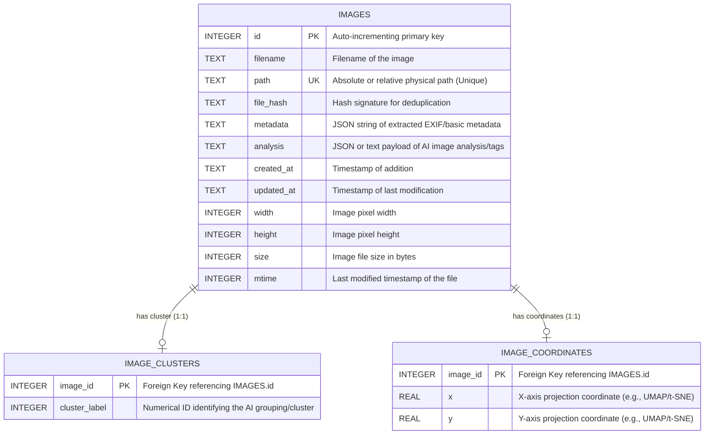

# LM AI Studio Database (`images.db`)

This document provides a complete overview of the local SQLite database schema (`images.db`) that manages the image assets, analytical metadata, and mapped clustering coordinates for Lumina.

## 🗄️ Entity-Relationship Diagram

## 📋 Tables Overview

### 1. `images`
This is the core table that tracks all physical image files successfully ingested into the studio. It stores both standard file-system metadata and the rich AI analysis.

| Column | Type | Constraints | Description |
| :--- | :--- | :--- | :--- |
| `id` | INTEGER | `PRIMARY KEY`, `AUTOINCREMENT` | Unique identifier for each image. |
| `filename` | TEXT | `NOT NULL` | The name of the file (e.g., `image1.png`). |
| `path` | TEXT | `UNIQUE` | The relative or absolute path to the file. Used to prevent duplicate imports and pull thumbnails. |
| `file_hash` | TEXT | | A hash string used to identify physical file changes and prevent deduplication errors. |
| `metadata` | TEXT | | System stringified details (often EXIF data or basic properties). |
| `analysis` | TEXT | | The textual descriptions or AI-generated tagging output representing the visual content. |
| `created_at` | TEXT | `DEFAULT CURRENT_TIMESTAMP` | Automatically registers when the image record was created. |
| `updated_at` | TEXT | | Tracking for when the record was last altered via re-scan or analysis change. |
| `width` | INTEGER | | Source image's physical canvas width in pixels. |
| `height` | INTEGER | | Source image's physical canvas height in pixels. |
| `size` | INTEGER | | File storage size mapping (in bytes). |
| `mtime` | INTEGER | | The native filesystem 'Modified Time' for tracking file system updates. |

### 2. `image_clusters`
A lightweight relationship table representing unsupervised clustering assignments previously applied to the dataset.
- **`image_id`** (`INTEGER PRIMARY KEY`): A 1:1 map directly back to `images.id`. 
- **`cluster_label`** (`INTEGER`): An assigned categorical grouping index (e.g., `0`, `1`, `2`) calculated downstream by mathematical clustering algorithms (like Latent Scope or EVOC).

### 3. `image_coordinates`
A specialized table managing the 2D floating-point visualization vectors utilized by your Data Map (`scope.html`/`scope.js` exports).
- **`image_id`** (`INTEGER PRIMARY KEY`): A 1:1 map directly back to `images.id`.
- **`x`** (`REAL`): The horizontal Cartesian projection coordinate generated via embeddings (UMAP, t-SNE, PCA).
- **`y`** (`REAL`): The vertical Cartesian projection coordinate.

### 4. `sqlite_sequence`
This table is an internal tracking mechanism automatically generated and maintained by the SQLite engine itself.
- It contains internal configuration (`name`, `seq`) specifically used to track the latest `AUTOINCREMENT` running integer on the `id` column for the `images` table. It does not contain user-facing data.
