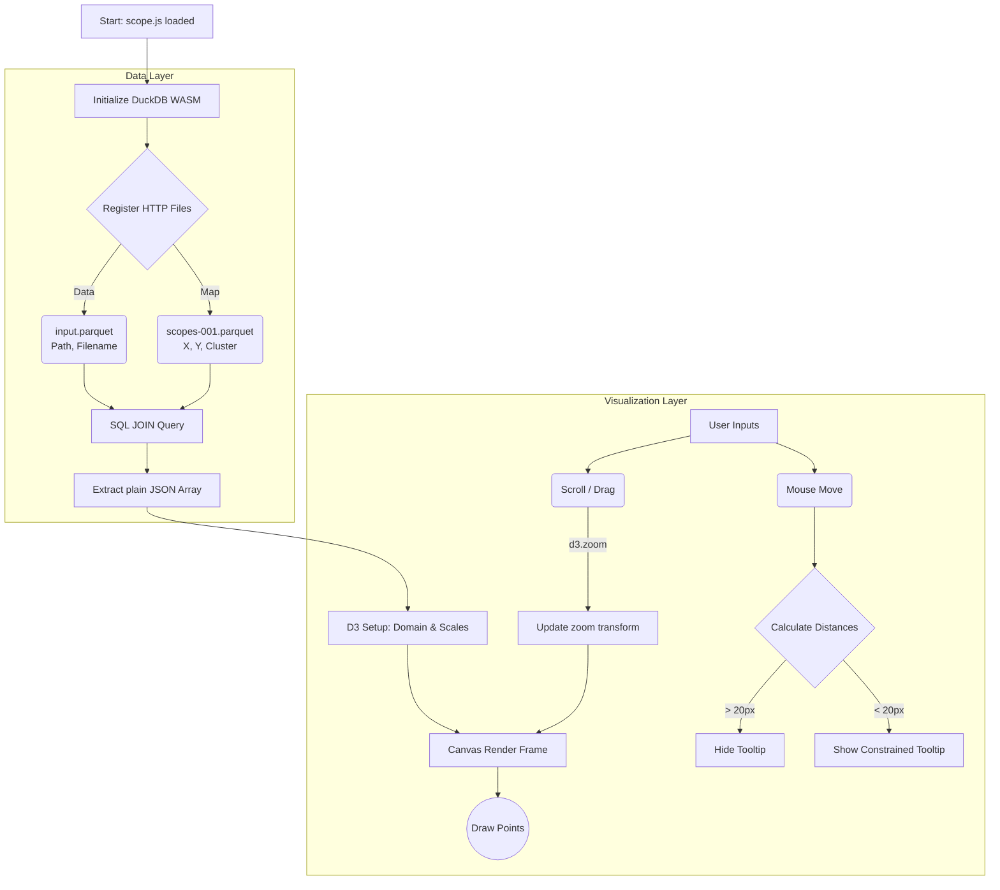

# Scope.js Documentation

This document provides a tutorial-style overview and architectural breakdown of `scope.js`. The file powers the interactive 2D data map in Lumina, utilizing **DuckDB WebAssembly** for high-speed edge data processing and **D3.js** for performant canvas rendering.

---

## 🏗️ Architecture Flow

The system operates in a unified pipeline: loading massive parquet files entirely within the browser, computing a SQL join to marry image metadata with vector embeddings, and continuously rendering the results to an HTML5 Canvas using D3 zoom matrices.

---

## 📚 Core Modules

### 1. Database Initialization (`init()`)
The map doesn't use the Node.js backend to fetch thousands of coordinate pairs, because transferring massive JSON arrays over HTTP is slow. Instead, it uses **DuckDB WebAssembly** to run a full analytical SQL database directly inside the browser tab.
- It pulls `.parquet` files generated remotely by Latent Scope.
- It joins the `scopes.parquet` (which has the `x` and `y` mathematically reduced coordinates) with `input.parquet` (which has the `path` and `filename` so we know *what* image the dot represents).

### 2. D3 Mathematical Scales (`setupViz()`)
To map abstract numbers (like an `x` coordinate of `-140.5`) to actual pixels on your monitor (like `450` pixels from the left):
- **`d3.extent`** is used to find the absolute minimum and maximum `x` and `y` points.
- **`d3.scaleLinear`** builds a mathematical bridge (domain to range) connecting the absolute minimum/maximum data values to the pixel boundaries (`[0, width]` and `[height, 0]`) of the canvas wrapper. (Note that Y is inverted because mathematical Y=0 is at the bottom, but CSS Y=0 is at the top).

### 3. High-Performance Canvas Rendering (`render()`)
With thousands of points, manipulating the DOM using SVG elements or raw HTML `
`s would crash the browser. We use HTML5 `<canvas>`.
- **`context.save()` / `context.restore()`**: We save the default blank canvas state.
- **`context.translate()` / `context.scale()`**: Instead of recalculating new `x` and `y` positions for 10,000 dots on every tiny mouse movement, we simply shift and stretch the *entire drawing board* beneath them.
- **Radius Scaling**: Because the board scales up (zooming in), the dots would also physically bloat to massive circles. To keep them looking like small dots, we divide their drawing radius by `transform.k` (the zoom multiplier).

### 4. Interactive Distance Checking (`mousemove`)
Whenever the mouse moves, D3 captures its canvas-relative coordinates (`mx`, `my`).
- It iterates through every single point in the database.
- It calculates where that point is currently being drawn using `transform.applyX/Y`.
- It uses basic Pythagorean theorem (`Math.hypot`) to measure the diagonal pixel distance between your mouse and the dot.
- If the dot is within 20 pixels and is the closest one evaluated so far, `showTooltip()` is triggered.

### 5. Smart Tooltip (`showTooltip()`)
When a hover is successful, the app sets the tooltip to `display: flex`.
- It dynamically replaces the filename extension with `.avif` to load the highly compressed thumbnail preview.
- It calculates bounding box collisions. Since it naturally tries to spawn `32px` to the bottom right of the cursor, it actively checks if this puts it off the right or bottom edges of the canvas. If so, it subtracts the tooltip's physical width/height, effectively flipping it to the left or top of the cursor geometry to keep it smoothly on-screen.
