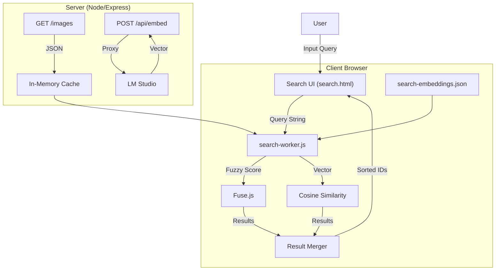
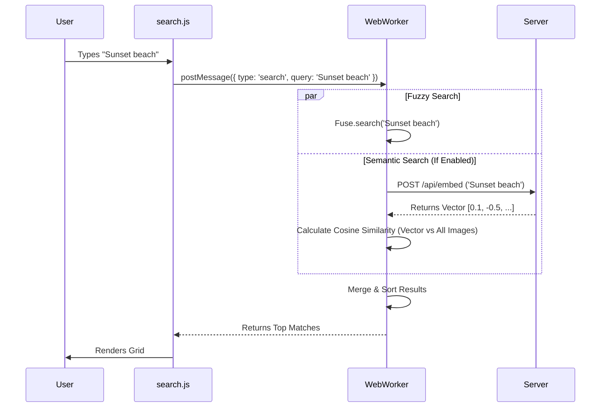

# Search Functionality Documentation

> [!NOTE]
> This document provides a comprehensive breakdown of the search system in **Lumina (LM AI Studio)**, detailed architecture diagrams, technology stack, and future development concepts.

## 1. System Overview

The search module is a **Hybrid Search** system combining **Client-Side Fuzzy Search** (Fuse.js) with **Semantic Vector Search** (Embeddings). It allows users to query:
1.  **Exact Metadata**: Filenames, exact tag matches.
2.  **Fuzzy Text**: "mountians" finding "mountains".
3.  **Conceptual / Semantic**: "sad robot" finding an image of a lonely droid, even if the word "sad" isn't used.

This hybrid approach ensures high precision for known items and high recall for abstract concepts.

---

## 2. Technology Stack

### Core Search Engine: **[Fuse.js](https://fusejs.io/)**
- **Role**: Keyword and Fuzzy matching.
- **Why?**: Lightweight, zero-dependency, runs entirely in browser. Perfect for rapid filtering of metadata.

### Semantic Engine: **Vector Embeddings**
- **Provider**: **LM Studio** (local API) running models like `nomic-embed-text`.
- **Storage**: `public/search-embeddings.json` (Static map of ImageID -> Vector).
- **Computation**: **Cosine Similarity** calculated in a **Web Worker** to prevent UI freezing.

### Frontend Performance: **IntersectionObserver & @chenglou/pretext**
- **Infinite Scroll**: Renders items in batches of 50 to maintain high frame rates.
- **Layout Engine**: Uses `@chenglou/pretext` to pre-calculate summary text heights before DOM insertion.
- **Benefits**: Eliminates "jumping" layout shifts and synchronous reflows, ensuring smooth 60fps scrolling even with hundreds of results.

### Backend Support: **Node.js (Express)**
- **Endpoints**:
    - `GET /images`: Serves raw metadata index.
    - `POST /api/embed`: Proxies user query to LM Studio for vectorization.
    - `POST /maintenance/generate-embeddings`: Batch process for generating embeddings for the library.

---

## 3. Architecture & Data Flow

### Hybrid Search Architecture


### Search Execution Logic


---

## 4. Deep Dive: Search Logic

### The Indexing Strategy
When `search.html` loads, it performs a heavy initialization step (offloaded to `search-worker.js`):
1.  Fetches `GET /images` (Metadata).
2.  Fetches `search-embeddings.json` (Vectors).
3.  Initializes **Fuse.js** index.
4.  Prepares Vector store.

### Weighting & configuration
The search is not democratic; different fields have different "importance" (weights). We prioritize explicit tags over general summaries.

```javascript
/* search-worker.js - initFuse() */
const options = {
    includeScore: true,
    threshold: 0.2, // Configurable via slider
    keys: [
        { name: 'filename', weight: 1 },        // Base priority
        { name: 'analysis.summary', weight: 1 }, // Base priority
        { name: 'analysis.objects', weight: 2 }, // High priority (2x)
        { name: 'analysis.tags', weight: 2 }     // High priority (2x)
    ]
};
```

### Semantic Search Workflow
1.  **Generation**: User clicks "Generate Data". Server iterates all images, sends description/tags to LM Studio (`text-embedding` model), and saves the resulting 768-dim vector to `search-embeddings.json`.
2.  **Querying**: User types "Peaceful". "Semantic Mode" is ON.
3.  **Vectorization**: Application sends "Peaceful" to `/api/embed`.
4.  **Comparison**: The resulting vector is compared against all 5,000+ cached vectors using dot product (Cosine Similarity).
5.  **Threshold**: Matches with similarity > 0.4 are returned.

### Filtering Layer
The `search-worker.js` acts as a pipeline that chains strict filters *after* the fuzzy/semantic search:
1.  **Search Phase**: Get broad candidates (from Fuse or Vector).
2.  **Strict Filter (Scene)**: `if (img.scene_type !== selectedType) discard`.
3.  **Strict Filter (Date)**: `if (img.created_at < startDate) discard`.

---

## 5. Review & Future Development

### Strengths
- **Responsiveness**: Extremely fast for datasets < 5,000 images.
- **Privacy**: 100% Local. No data leaves the machine.
- **Flexibility**: Hybrid approach covers both explicit keywords and vague concepts.

### Current Limitations
- **Scalability**: Scaling to 100k+ images will require moving from JSON files to a real vector database (like `pgvector` or `chromadb`).
- **Memory Usage**: The entire database is held in client RAM.

### Recommended Improvements

#### Phase 1: Enhanced Filtering (Immediate Value)
- [x] **Negative Search**: Support `-card` to exclude results.
- [x] **Tag-Click Filtering**: Clicking a tag in a result card adds it to search.
- [x] **Sort Options**: Allow sorting by "Relevance" vs "Date".

#### Phase 2: Hybrid Search (Completed)
- [x] **Web Worker**: Fuse.js and Vector logic moved to `search-worker.js` for non-blocking UI.
- [x] **Semantic Search**: Full implementation of local embeddings.
- [x] **Model Config**: Settings UI to managing Vision vs Embedding models.

#### Phase 3: Optimizations (Scalability)
- [ ] **Binary Embeddings**: Compress JSON vectors to binary buffers to reduce load time/size by 3x.
- [ ] **HNSW Index**: Implement a proper HNSW index (via library) instead of brute-force Cosine Similarity for faster vector lookups.

### Design Concepts for Improvement
> [!TIP]
> **Visual Query Builder:** Instead of a single text box, a "pill" based input system (like Gmail or GitHub issues) where `type:indoor` and `tag:blue` created distinct visual chips.

> [!TIP]
> **Discovery Mode:** A "Random Shuffle" or "More Like This" button on result cards that uses tag intersection to find visually similar images.
