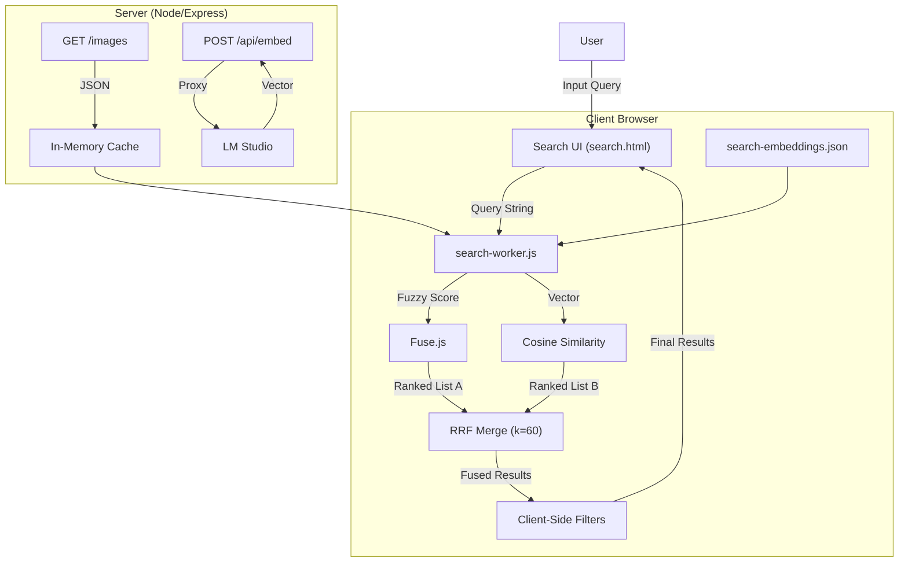
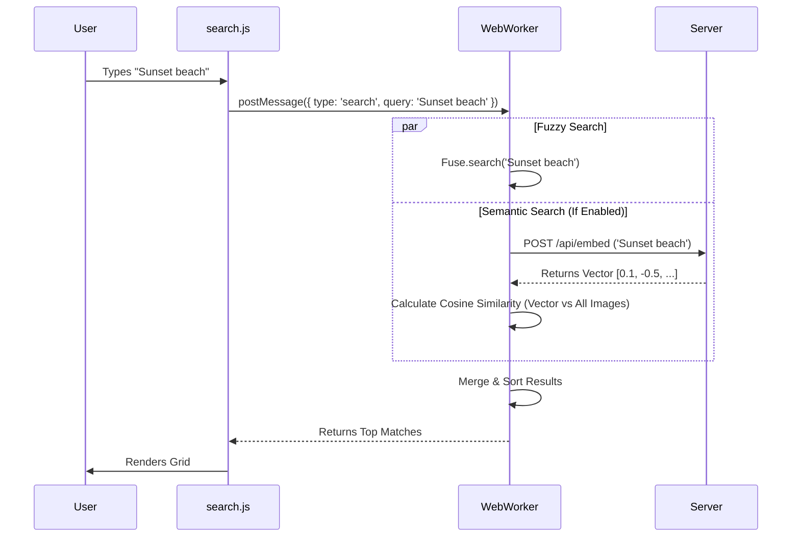

# Search Functionality Documentation

> [!NOTE]
> This document provides a comprehensive breakdown of the search system in **Lumina (LM AI Studio)**, detailed architecture diagrams, technology stack, and future development concepts.

## 1. System Overview

The search module is a **Hybrid Search** system combining **Client-Side Fuzzy Search** (Fuse.js) with **Semantic Vector Search** (Embeddings) and **Reciprocal Rank Fusion (RRF)**. It allows users to query:
1.  **Exact Metadata**: Filenames, exact tag matches.
2.  **Fuzzy Text**: "mountians" finding "mountains".
3.  **Conceptual / Semantic**: "sad robot" finding an image of a lonely droid, even if the word "sad" isn't used.
4.  **Hybrid (RRF)**: Combines keyword and semantic results into a single ranked list — exact matches *and* conceptual understanding together.

This hybrid approach ensures high precision for known items and high recall for abstract concepts.

### Search Modes

| Mode | Engine | Best For |
|------|--------|----------|
| ⌨️ **Keyword** | Fuse.js fuzzy matching | Exact filenames, known tags, typo-tolerant searches |
| ⚡ **Hybrid** (Default) | Fuse.js + Cosine Similarity → RRF merge | General-purpose. Best of both worlds. |
| 🧠 **Semantic** | Cosine Similarity only | Abstract concepts ("peaceful morning", "cyberpunk vibe") |

> Hybrid mode auto-selects when embeddings are available. If the embedding API fails, it gracefully falls back to keyword-only.

---

## 2. Technology Stack

### Core Search Engine: **[Fuse.js](https://fusejs.io/)**
- **Role**: Keyword and Fuzzy matching.
- **Why?**: Lightweight, zero-dependency, runs entirely in browser. Perfect for rapid filtering of metadata.

### Semantic Engine: **Vector Embeddings**
- **Provider**: **LM Studio** (local API) running models like `nomic-embed-text`.
- **Storage**: `public/search-embeddings.json` (Static map of ImageID -> Vector).
- **Computation**: **Cosine Similarity** calculated in a **Web Worker** to prevent UI freezing.

### Frontend Performance: **IntersectionObserver & @chenglou/pretext**
- **Infinite Scroll**: Renders items in batches of 50 to maintain high frame rates.
- **Layout Engine**: Uses `@chenglou/pretext` to pre-calculate summary text heights before DOM insertion.
- **Benefits**: Eliminates "jumping" layout shifts and synchronous reflows, ensuring smooth 60fps scrolling even with hundreds of results.

### Backend Support: **Node.js (Express)**
- **Endpoints**:
    - `GET /images`: Serves raw metadata index.
    - `POST /api/embed`: Proxies user query to LM Studio for vectorization.
    - `POST /maintenance/generate-embeddings`: Batch process for generating embeddings for the library.

---

## 3. Architecture & Data Flow

### Hybrid Search Architecture


### Search Execution Logic


---

## 4. Deep Dive: Search Logic

### The Indexing Strategy
When `search.html` loads, it performs a heavy initialization step (offloaded to `search-worker.js`):
1.  Fetches `GET /images` (Metadata).
2.  Fetches `search-embeddings.json` (Vectors).
3.  Initializes **Fuse.js** index.
4.  Prepares Vector store.

### Weighting & configuration
The search is not democratic; different fields have different "importance" (weights). We prioritize explicit tags over general summaries.

```javascript
/* search-worker.js - initFuse() */
const options = {
    includeScore: true,
    threshold: 0.2, // Configurable via slider
    keys: [
        { name: 'filename', weight: 1 },        // Base priority
        { name: 'analysis.summary', weight: 1 }, // Base priority
        { name: 'analysis.objects', weight: 2 }, // High priority (2x)
        { name: 'analysis.tags', weight: 2 }     // High priority (2x)
    ]
};
```

### Semantic Search Workflow
1.  **Generation**: User clicks "Generate Data". Server iterates all images, sends description/tags to LM Studio (`text-embedding` model), and saves the resulting 768-dim vector to `search-embeddings.json`.
2.  **Querying**: User types "Peaceful". "Semantic Mode" is ON.
3.  **Vectorization**: Application sends "Peaceful" to `/api/embed`.
4.  **Comparison**: The resulting vector is compared against all 5,000+ cached vectors using dot product (Cosine Similarity).
5.  **Threshold**: Matches with similarity > 0.4 are returned.

### Reciprocal Rank Fusion (RRF)

Inspired by [Exa's Canon search pipeline architecture](https://exa.ai/blog/composing-a-search-engine), the Hybrid mode uses **Reciprocal Rank Fusion** to merge the keyword and semantic result lists.

**Formula:** `RRF(doc) = Σ 1/(k + rank_i)` where `k = 60`

A document ranked #1 in keyword search gets score `1/61 ≈ 0.0164`. If the same document is ranked #5 in semantic search, it gets an additional `1/65 ≈ 0.0154`, for a combined score of `0.0318`. Documents appearing in *both* result sets naturally bubble to the top.

```javascript
/* search-worker.js - reciprocalRankFusion() */
const RRF_K = 60;

function reciprocalRankFusion(keywordResults, semanticResults) {
    const scoreMap = new Map();
    keywordResults.forEach((item, rank) => {
        scoreMap.set(item.id, { item, score: 1 / (RRF_K + rank) });
    });
    semanticResults.forEach((item, rank) => {
        const entry = scoreMap.get(item.id);
        if (entry) entry.score += 1 / (RRF_K + rank);
        else scoreMap.set(item.id, { item, score: 1 / (RRF_K + rank) });
    });
    return [...scoreMap.values()].sort((a, b) => b.score - a.score).map(e => e.item);
}
```

### Filtering Layer
The `applyClientFilters()` function in `search.js` chains strict filters *after* the fuzzy/semantic/hybrid search:
1.  **Search Phase**: Get broad candidates (from Fuse, Vector, or RRF merge).
2.  **Tag/Object Pre-Filter**: Exact match on selected filter chips (AND/OR logic).
3.  **Negative Filter**: Exclude results containing specified terms.
4.  **Strict Filter (Scene)**: `if (img.scene_type !== selectedType) discard`.
5.  **Strict Filter (Date)**: `if (img.created_at < startDate) discard`.
6.  **Data Status Filter**: Show only images missing specific metadata fields.

---

## 5. Review & Future Development

### Strengths
- **Responsiveness**: Extremely fast for datasets < 5,000 images.
- **Privacy**: 100% Local. No data leaves the machine.
- **Flexibility**: Hybrid approach covers both explicit keywords and vague concepts.

### Current Limitations
- **Scalability**: Scaling to 100k+ images will require moving from JSON files to a real vector database (like `pgvector` or `chromadb`).
- **Memory Usage**: The entire database is held in client RAM.

### Recommended Improvements

#### Phase 1: Enhanced Filtering (Immediate Value)
- [x] **Negative Search**: Support `-card` to exclude results.
- [x] **Bulk Rename Results**: Select any number of search results and rename them sequentially on disk and in the DB.
- [x] **Masonry Grid (A, B, C Row Layout)**: Implementation of a dense, multi-column masonry grid that ensures a minimum of 3 columns and follows row-packing order.
- [x] **Tag Discovery Row**: A toggleable, full-width section for exploring Top Tags and Objects as horizontal chip clouds, replacing the old vertical sidebar.
- [x] **Optimized Filter Layout**: Search controls consolidated into a clean 2-column grid for better information density.

#### Phase 2: Hybrid Search (Completed)
- [x] **Web Worker**: Fuse.js and Vector logic moved to `search-worker.js` for non-blocking UI.
- [x] **Semantic Search**: Full implementation of local embeddings.
- [x] **Model Config**: Settings UI to managing Vision vs Embedding models.
- [x] **Reciprocal Rank Fusion**: Hybrid mode merges keyword + semantic results using RRF (k=60), inspired by Exa's Canon architecture.
- [x] **3-Way Search Mode**: Segmented control selector (Keyword | Hybrid | Semantic) with auto-detection of embeddings availability.

#### Phase 3: Optimizations (Scalability)
- [ ] **Binary Embeddings**: Compress JSON vectors to binary buffers to reduce load time/size by 3x.
- [ ] **HNSW Index**: Implement a proper HNSW index (via library) instead of brute-force Cosine Similarity for faster vector lookups.

### Design Concepts for Improvement
> [!TIP]
> **Visual Query Builder:** Instead of a single text box, a "pill" based input system (like Gmail or GitHub issues) where `type:indoor` and `tag:blue` created distinct visual chips.

> [!TIP]
> **Discovery Mode:** A "Random Shuffle" or "More Like This" button on result cards that uses tag intersection to find visually similar images.

---

## 6. UI Tooltip Reference

All interactive elements on the search page include descriptive `title` tooltips for user guidance. Below is a complete reference.

### Search Controls

| Element | Tooltip |
|---|---|
| Search input | Enter keywords to search across image descriptions, filenames, tags, and objects. Press Enter to search. |
| Negative input | Enter words to exclude from results. Images containing any of these terms will be filtered out. |
| AND/OR toggle | Toggle between AND (match all terms) and OR (match any term) logic |
| Tag filter input | Type a tag or object name to see autocomplete suggestions. Select items to add them as filter chips. |
| Tag logic AND | AND: results must match ALL selected tags and objects |
| Tag logic OR | OR: results can match ANY of the selected tags or objects |
| Fuzziness slider | Controls how loosely keywords are matched. 0.0 = exact matches only. 0.6 = very loose, tolerates typos and partial matches. |
| ⌨️ Keyword mode | Uses Fuse.js fuzzy matching to search text in summaries, tags, and objects. Fuzziness slider controls match strictness. |
| ⚡ Hybrid mode | Runs both keyword and semantic search simultaneously, then merges results using Reciprocal Rank Fusion (RRF). Best of both worlds. |
| 🧠 Semantic mode | Uses AI embeddings to find conceptually similar images. Great for abstract queries like 'peaceful morning' or 'cyberpunk vibe'. |
| Generate Data | Generate AI embeddings for all images in the database. Required for Hybrid and Semantic search modes. |
| Sort Order | Choose how results are ordered. Relevance uses the search engine score; Newest/Oldest sorts by file creation date. |
| Scene Type | Filter results by the AI-detected scene classification badge assigned during analysis. |
| Data Status | Filter images by their analysis completeness. Use this to find images that still need AI processing. |
| Start/End Date | Show only images created within the specified date range. |
| Search Images button | Execute the search with current filters and settings. You can also press Enter in the search field. |
| Scope: Summaries | Include AI-generated image descriptions in keyword search |
| Scope: Objects | Include detected objects (e.g. 'cat', 'car', 'tree') in keyword search |
| Scope: Tags | Include extracted tags (e.g. 'sunset', 'portrait') in keyword search |

### Sidebar Controls

| Element | Tooltip |
|---|---|
| Prompt Type selector | Choose the AI analysis mode for batch processing. Controls how the vision model describes selected images. |
| Select Missing | Auto-select all visible images missing tags, objects, or a summary. Use with 'Process' to batch-analyze. |
| Unselect All | Clear the current selection of images |
| Process (N) | Re-analyze all selected images using the chosen analysis mode. Each image will be sent to the AI vision model. |
| Bulk Rename | Rename all selected images using a shared base name. Automatically fills gaps in existing sequences. |
| 🛠️ Check | Run a database integrity check: detects duplicates, repairs metadata, removes missing files, and regenerates broken thumbnails. |
| Discover Tags & Objects | Toggle visibility of the top tags and objects panel. Click a tag or object to add it as a search filter. |

### Context Menu (Right-Click)

| Item | Tooltip |
|---|---|
| 🔄 Regenerate Thumbnail | Re-create the thumbnail for this image from the original file |
| ✏️ Edit Tag | Edit the text of this tag or object inline |
| 📝 Edit Description | Edit the AI-generated description for this image |
| 🛠️ Reparse Description | Re-extract tags and objects from the existing description without re-analyzing the image |
| 🔎 Find Similar | Search for images with matching tags, objects, and descriptions |
| 🔍 Re-analyze Image | Send this image back to the AI vision model for a fresh analysis |
| 🗑️ Delete Tag | Remove this tag or object from the image's metadata |
| 📝 Rename File | Rename this file on disk |
