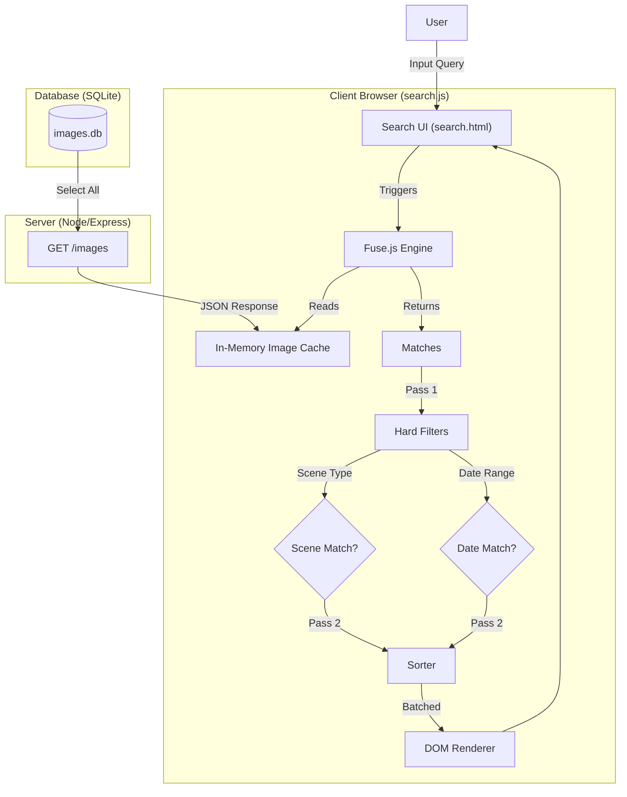
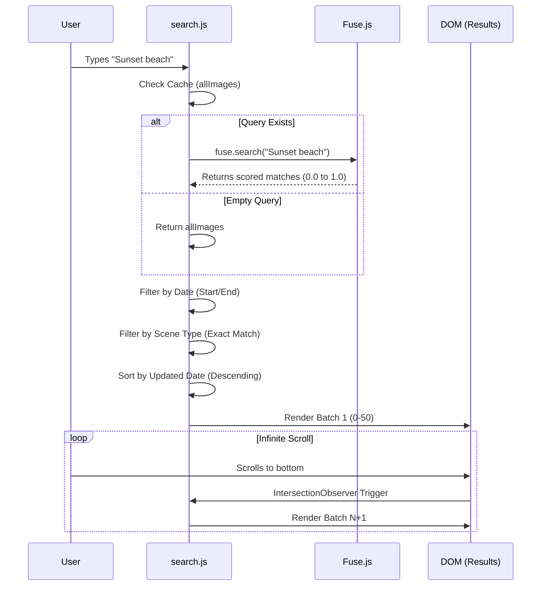

# Search Functionality Documentation

> [!NOTE]
> This document provides a comprehensive breakdown of the search system in **Lumina (LM AI Studio)**, detailed architecture diagrams, technology stack, and future development concepts.

## 1. System Overview

The search module is a **Client-Side Fuzzy Search** system designed for rapid, responsive filtering of the image database. It allows users to query natural language descriptions, object lists, and tags generated by the AI analysis engine.

Unlike traditional server-side SQL searches (LIKE queries), this system loads the dataset into the browser's memory and uses a fuzzy matching algorithm. This enables:
- **Instant Feedback**: Results appear immediately as you type (or on Enter).
- **Tolerance for Typos**: "mountians" will still find "mountains".
- **Rich Metadata Searching**: Simultaneously searches filenames, AI summaries, objects, and tags.

---

## 2. Technology Stack

### Core Search Engine: **[Fuse.js](https://fusejs.io/)**
- **Why?**: Fuse.js is a lightweight, zero-dependency fuzzy-search library that runs entirely in the browser. It is perfect for datasets of this size (< 10,000 items) where server round-trips for every keystroke would ideally be avoided to maintain a "snappy" feel.
- **Key Features Used**: Scoring, weighting, and thresholding.

### Frontend Performance: **IntersectionObserver API**
- **Why?**: Rendering thousands of DOM elements (image cards) freezes the browser.
- **Implementation**: We implementing an "Infinite Scroll" pattern. Only the top 50 results (`BATCH_SIZE`) are rendered initially. A generic "sentinel" element at the bottom of the list triggers the `Observer` when it comes into view, which then appends the next batch of results.

### Backend Support: **Node.js (Express) & SQLite**
- **Why?**: The server provides a robust `GET /images` endpoint that serves the raw JSON data. While `server.js` has a legacy SQL-based search endpoint, the modern frontend bypasses this in favor of the more powerful Fuse.js implementation.
- **Metadata**: Exif extraction and AI analysis (Qwen VL) provide the rich text data that makes the search useful.

---

## 3. Architecture & Data Flow

### System Architecture


### Search Execution Logic


---

## 4. Deep Dive: Search Logic

### The Indexing Strategy
When `search.html` loads, it performs a heavy initialization step:
1. Calls `GET /images`.
2. Receives a JSON array of all image records.
3. Parses the `analysis` string (stored as JSON text in SQLite) into a real Object.
4. Maps this data into a structure Fuse.js can consume.
5. **Initializes the Fuse Index** with specific keys and weights.

### Weighting & configuration
The search is not democratic; different fields have different "importance" (weights). We prioritize explicit tags over general summaries.

```javascript
/* search.js - initFuse() */
const options = {
    includeScore: true,
    threshold: 0.2, // Configurable via slider
    keys: [
        { name: 'filename', weight: 1 },        // Base priority
        { name: 'analysis.summary', weight: 1 }, // Base priority
        { name: 'analysis.objects', weight: 2 }, // High priority (2x)
        { name: 'analysis.tags', weight: 2 }     // High priority (2x)
    ]
};
```
- **Threshold**: Determines "how fuzzy" the search is.
    - `0.0`: Exact match only.
    - `0.2` (Default): Allows minor typos / slight variations.
    - `0.6`: Very loose matches (can return irrelevant results).
- **Weights**: If you search "Dog", an image with the **Tag** "Dog" (weight 2) will appear higher than an image where the word "dog" just appears in the **Summary** (weight 1).

### Filtering Layer
Fuse.js only handles the text matching. The `performSearch()` function acts as a pipeline that chains strict filters *after* the fuzzy search:
1. **Fuzzy Match**: Get broad candidates.
2. **Strict Filter (Scene)**: `if (img.scene_type !== selectedType) discard`.
3. **Strict Filter (Date)**: `if (img.created_at < startDate) discard`.

This "Broad-then-Narrow" approach ensures users don't miss relevant items due to typos, but also don't get irrelevant items that don't match their hard constraints (like date).

---

## 5. Review & Future Development

### Strengths
- **Responsiveness**: Extremely fast for datasets < 5,000 images.
- **UX**: Real-time feedback and infinite scroll feel modern.
- **Simplicity**: No complex server-side search infrastructure (ElasticSearch, Solr) to maintain.

### Current Limitations
- **Scalability**: Scaling to 10k+ or 100k+ images will degrade browser performance. Loading the entire JSON blob on initialization will become slow (MBs of data).
- **Memory Usage**: The entire database is held in client RAM.
- **Complex Logic**: "OR" logic (Match Any) vs "AND" logic (Match All) capabilities are limited in the current Fuse configuration.

### Recommended Improvements

#### Phase 1: Enhanced Filtering (Immediate Value)
- [ ] **Negative Search**: Allow `-dog` to exclude results.
- [ ] **Tag-Click Filtering**: Clicking a tag in a result card should add it to the search bar automatically (e.g. `tag:nature`).
- [ ] **Sort Options**: Allow sorting by "Relevance" (Fuse Score) vs "Date". Currently, it forces Date sort, which sometimes hides the "best" test match down the list.

#### Phase 2: Hybrid Search (Scalability)
- [ ] **Pre-Generated Index**: The server already generates `search-index.json`. We should serve this static file instead of raw `/images` JSON to reduce payload size and parsing time.
- [ ] **Web Worker**: Move the Fuse.js logic into a Web Worker. This prevents the UI thread from hanging during search calculation on large datasets.

#### Phase 3: Semantic Search (The "Dream" Feature)
- [ ] **Vector/Embeddings**: Instead of matching text strings, use a local embedding model (like `clip-search`).
    - **Concept**: Convert the user's text query ("A sad robot in the rain") into a vector. Compare it against pre-calculated vectors of the images.
    - **Benefit**: This allows searching for *concepts*, not just keywords. It would find the robot even if the word "sad" isn't strictly in the tags, but the *vibe* is sad.

### Design Concepts for Improvement
> [!TIP]
> **Visual Query Builder:** Instead of a single text box, a "pill" based input system (like Gmail or GitHub issues) where `type:indoor` and `tag:blue` created distinct visual chips.

> [!TIP]
> **Discovery Mode:** A "Random Shuffle" or "More Like This" button on result cards that uses tag intersection to find visually similar images.
